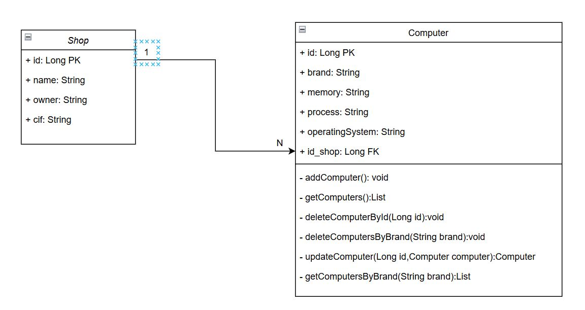

# Computer Shop API

API REST para la gestión de ordenadores de una tienda en una aplicación de inventario de equipos informáticos. Desarrollada con Spring Boot y diseñada para interactuar con una base de datos relacional usando JPA y Hibernate.

## Características

- **Gestión de Computadoras**: Permite agregar, listar, buscar, actualizar y eliminar ordenadores a la tienda.
- **Gestión de Tiendas**: Asocia cada computadora a una tienda específica y permite borrar computadoras de una tienda específica según la marca.
- **Búsqueda**: Incluye métodos para encontrar ordenadores por marca.

## Tecnologías Utilizadas

- Java
- Spring Boot
- Spring Data JPA
- Hibernate
- H2 Database (para pruebas en memoria)
- Maven

## Diagrama UML

## Instalación

1. **Clonar el repositorio**:
   
   git clone https://github.com/Susana-Artime/computerShop.git
  
   
3.  **Configurar la Base de Datos**:
   
   El proyecto está configurado para usar una base de datos en memoria H2 por defecto. Puedes cambiar esto en el archivo **application.properties** si deseas usar una base de datos relacional como MySQL.

4. **Compilar y Ejecutar el Proyecto**:

   Ejecuta el siguiente comando para compilar y lanzar la aplicación:
   
   mvn spring-boot:run

## API REST CRUD

Despues de lanzar la aplicacion, se puede consultar la documentacion interactiva de Swagger en este enlace http://localhost:8080/swagger-ui.html

Además se puede ver la informacion de la base de datos en memoria en la consola de H2 http://localhost:8080/h2-console/

## Estructura del Proyecto

**models/:** Contiene las clases de modelo para Computer y Shop.

**repositories/:** Define los repositorios para acceder a la base de datos.

**services/:** Contiene la lógica de negocio de la aplicación.

**controllers/:** Define los controladores REST para los endpoints.

